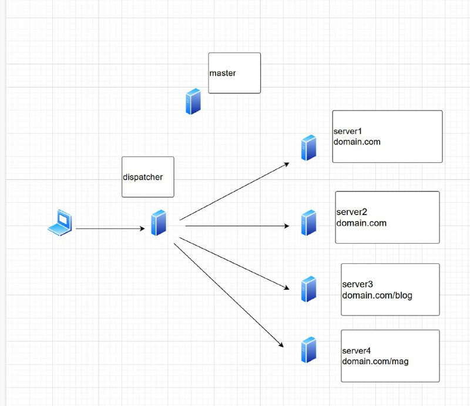

<h2>An introduction to ansible:</h2>
In a nutshell configuration management software automates the management of operating systems on a network. Administrators write specifications that describe how servers should be configured, and the configuration management software do the rest.
The traditional approach to sysadmin automation complex shell scripts which over time degenerate into an unmanagable piece of code. On the contrary configuration management is a better approach. It captures desired state in the form of code. Changes and updates can then be tracked over time in a version control system.
Ultimately, the job of a CM system is to apply a series of configuration specifications to an individual machine. Operations that are typically  might plausibly appear on a sysadmin’s to-do list: create a user account, install a software package, and so on. 
<h3>Main elements of configuration management:</h3>
<h4>Operations and parameters:</h4>
We’ve already introduced the concept of operations, which are the small-scale actions and checks used by a CM system to achieve a particular state.
Here are some sample operations that all CM systems can handle right out of the box:

* Create or remove a user account or set its attributes
* Copy files to or from the system being configured
* Synchronize directory contents
* Render a configuration file template
* Add a new line in a configuration file
* Restart a service
* Add a cron job or systemd timer
* Run an arbitrary shell command
* Create a new cloud server instance
* Create or remove a database account
* Set database operating parameters
* Perform Git operations

Operations are basically scripts, usually written in the implementation language of the CM - python for ansible case- system itself and exploiting the system’s standard tools and libraries.

operations differ from typical UNIX commands in a few important ways:

* Most operations are designed to be applied repeatedly without causing problems. Borrowing a term from linear algebra, you’ll sometimes see this latter property referred to as *idempotence.*
* Operations know when they change the system’s actual state.
* Operations know when the system state needs to be changed. If the current configuration already conforms to the specification, the operation exits without doing anything.
* Operations report their results to the CM system. Their report data is richer than a UNIX-style exit code and can aid in debugging.
* Operations strive to be cross-platform. They usually define a constrained set of functions that are common to all supported platforms, and they interpret requests in accordance with the local system.

<h4>Variables:</h4>
Variables are named values that influence how configurations are applied to individual machines. They commonly set parameter values and fill in the blanks in configuration templates.
<h4>Facts:</h4>
CM systems investigate each configuration client to determine descriptive facts such as the IP address of the primary network interface and the OS type. This information is then accessible from within the configuration base through variable values. As with any other variable, these values can be used to define parameter values or to expand templates.All CM systems let target machines add their own values to the fact database, either by including a static file of declarations or by running custom code on the target machine.
<h4>Client inventory and registration:</h4>
Because CM systems define lots of ways to segregate clients into categories, the overall universe of machines under configuration management must be well defined.
<hr>

*Ansible uses no daemons at all (other than sshd), which is an appealing simplification. Configuration runs happen when an administrator (or cron job) on the server runs the ansible-playbook command. ansible-playbook executes the appropriate remote commands over SSH, leaving no trace of its presence on the client machine after configuration has completed. The only requirements for client machines are that they be accessible through SSH and have Python 2 installed. Both ansible-playbooks and inventories are written in YML.*

<h2>Hands on project:</h2>



Use Nginx for as your webserver
for internal communication use an internal network
use a docker file for making your docker image 
have a basic authentication on domain.com/mag
there should be a load balance in place using Nginx for server 1 & 2
use docker swarm to run this environment , you can have up to 4 workers and 1 master
if you try to inspect https://domain.com/ali in your browser you should see the header arvan-loc:ali
you need to have 2 wordpress instances -with shared storage- and one DB 
write a backup script for DB
use ansible to automate your tasks as much as possible

<h2>Solution:</h2>
I chose centos 7 as a base for my lab environment,
On master node you need to create an ssh key and populate it because Ansible do coordinate all other nodes through ssh

```
ssh-keygen
ssh-copy-id [server ip's]
```

Install ansible on your master node:

```
yum install epel-release
sudo yum update
sudo yum install ansible
```

Make a directory for your project:

```
mkdir playbook
cd playbook/
```

Download needed modules for ansible to be able to run the playbook & finally run your playbook:

```
ansible-galaxy collection install community.general
ansible-playbool ansible.yml
```

For ease of work I just included images in the docker compose file , but I will go through how to achieve the asked statements in Nginx

In order to add a header to Nginx you should add the following to the configuration:

```
location = /ali {
	    add_header arvanloc ali always;
        }
```

In order to serve these websites on HTTPS you should generate a certificate with the following command
```
openssl req -x509 -nodes -days 3650 -newkey rsa:2048 \
-subj /CN=localhost \
-keyout files/nginx.key -out files/nginx.crt # this will create both nginx.key and nginx.crt 
```
and then copy those to `/etc/nginx/ssl/` directory through your docker file then add these configurations to your nginx config file:
 
 ```
ssl_certificate /etc/nginx/ssl/nginx.crt;
ssl_certificate_key /etc/nginx/ssl/nginx.key;
```
To set basic authentication in place you need to generate a password we need htpasswd to create and generate an encrypted for the user using Basic Authentication. Install apache2-utils using the command below.

```
sudo apt-get install apache2-utils
```

and the next step is to create User and Password

```
sudo htpasswd -c .htpasswd exampleuser
```

The tool will prompt you for a password and you should provide one for it.
The next step would be to copy this file to `/etc/nginx/` in your container through your dockerfile and add the following to your nginx configuration:

```
location = /mag {
	    auth_basic "Restricted area";
      auth_basic_user_file /etc/apache2/.htpasswd;  
	    proxy_pass http://192.168.1.11:8004/; #provide your ip and port or service name if you are running a docker service
        }
```


